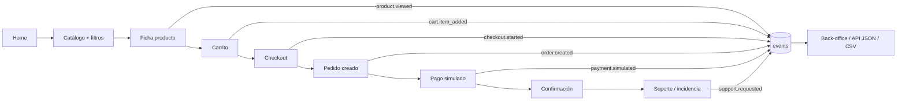
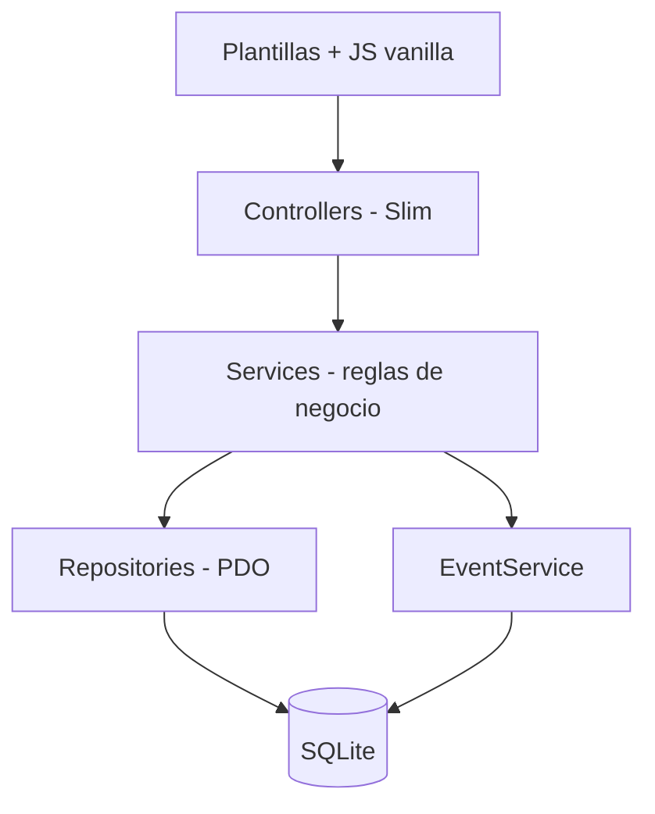
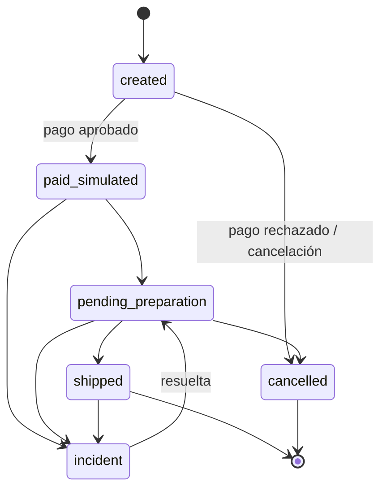

# PLANNING — Zapatero · Canal digital de venta

> **Tarea 1 · Soluciones Informáticas para la Empresa**
> Prototipo académico de eCommerce **sin actividad comercial real**: no hay pagos reales, datos personales reales ni credenciales reales.

---

## 1. Caso de empresa

**Zapatero** es una marca ficticia de **zapatillas casual con estampados y diseños gráficos originales**. Su propuesta de valor es un calzado cómodo para el día a día cuyo diferencial es el diseño gráfico.

- **No** trabaja con ediciones limitadas ni *drops*. Tiene un **catálogo estable**, siempre disponible y repuesto por talla.
- **Público objetivo:** personas de 18 a 35 años, urbanas, interesadas en el diseño, la ilustración y la moda casual.
- **Organización del catálogo**, en tres ejes:

| Eje | Valores |
|-----|---------|
| **Colección de diseño** | Urban Graffiti · Botanical · Retro Pixel · Geometric |
| **Estilo** | Low-top · High-top · Slip-on |
| **Talla** | EU 36 – 46 (stock por talla) |

- **Catálogo inicial:** entre 12 y 16 productos (el mínimo exigido son 8), con nombre, descripción, material, precio, colección, estilo, imágenes y stock por talla.

---

## 2. Alcance y requisitos (trazabilidad con el enunciado)

### 2.1 Funcionales (§3)
| Req. | Descripción | Cómo se cubre |
|------|-------------|---------------|
| 3.a | Página principal | Home con colecciones destacadas y aviso de prototipo |
| 3.b | Catálogo / listado | `/catalogo` con filtros por talla, colección y estilo |
| 3.c | Ficha de producto | `/producto/{slug}`: imágenes, descripción, material, selector de talla y stock |
| 3.d | ≥ 8 productos realistas | Seed con 12-16 productos coherentes |
| 3.e | Carrito | Carrito en sesión, persistido en BBDD al hacer checkout |
| 3.f | Checkout | Formulario de datos de envío con validación |
| 3.g | Impuestos, gastos y descuentos | IVA 21 %, envío y códigos de descuento (ver §6) |
| 3.h | Pago simulado | Pasarela simulada con tarjetas de prueba |
| 3.i | Pedido con ID único | `ZAP-AAAAMMDD-XXXX` |
| 3.j | Estados de pedido | Máquina de estados (ver §6) |
| 3.k | Back-office | `/admin`: pedidos, estados, eventos e incidencias |

### 2.2 Técnicos (§4)
| Req. | Cómo se cubre |
|------|---------------|
| 4.a Persistencia | SQLite mediante PDO |
| 4.b Modelo de datos | Ver §5 (productos, usuarios, pedidos, líneas, pagos, eventos…) |
| 4.c Separación de capas | Controllers → Services → Repositories |
| 4.d Datos de prueba | `database/seed.php` |
| 4.e Validación | Validación en servidor (Services) y HTML5 en cliente |
| 4.f Sin credenciales reales | `.env` ignorado por git, `.env.example` versionado y usuarios de prueba ficticios |
| 4.g Instrucciones | README |
| 4.h Despliegue público | Hosting DonDominio con dominio propio |

### 2.3 Eventos (§5)
`product.viewed` · `cart.item_added` · `checkout.started` · `order.created` · `payment.simulated` · `support.requested` / `incident.created` (detalle en §7).

---

## 3. Justificar decisiones tecnológicas

### 3.1 Restricciones de partida
- **Hosting: DonDominio**, un hosting compartido Linux (Apache + PHP + MySQL/MariaDB). No permite procesos persistentes de Node.js ni de Python.
- El proyecto es un **prototipo**, así que se priorizan tecnologías y bases de datos **ligeras**.
- El código debe ser **propio y defendible** en la exposición (§8 y §9 del enunciado), con commits de los 5 miembros.

### 3.2 Alternativas consideradas

**Backend**
| Opción | Ventajas | Desventajas | Decisión |
|--------|----------|-------------|----------|
| **PHP puro con MVC propio** | Cero dependencias; se despliega por FTP; 100 % código propio | Router, validación, sesiones y CSRF hechos a mano, con más riesgo de fallos de seguridad y más tiempo | Descartada |
| **Slim 4 + PDO** | Micro-framework ligero con router, middlewares y PSR-7 ya hechos; casi todo el código es propio y fácil de explicar | Necesita Composer (subir `vendor/` o tener SSH); menos "baterías incluidas" | ✅ **Elegida** |
| **Laravel 11** | Todo incluido (ORM, migraciones, auth, validación) | Pesado para un prototipo; despliegue delicado en hosting compartido; mucha "magia" difícil de defender | Descartada |
| **Next.js / Django / Node + React** | Stacks modernos | Necesitan un proceso Node o Python: **incompatibles con el hosting** | Descartadas |
| **WordPress + WooCommerce** | Tienda funcional en horas | Choca con la originalidad (§8) y con la defensa técnica; poco control sobre el modelo de datos y los eventos | Descartada |

**Base de datos**
| Opción | Ventajas | Desventajas | Decisión |
|--------|----------|-------------|----------|
| **SQLite** | Sin servidor ni credenciales; el mismo fichero en local y en producción; copia de seguridad trivial | Concurrencia de escritura limitada; depende de que `pdo_sqlite` esté activo | ✅ **Elegida** |
| **MySQL/MariaDB** | Incluida en DonDominio; phpMyAdmin | Requiere servidor en local y credenciales en `.env`, con más fricción para 5 personas | Descartada (alternativa de respaldo) |

**Frontend:** HTML renderizado en servidor (plantillas PHP) + CSS propio + JavaScript vanilla. **Sin build step**, así que no hace falta Node en ningún entorno.

### 3.3 Motivos de la elección (Slim 4 + SQLite)
1. **Compatibilidad total con DonDominio**: solo necesita PHP 8.x con `pdo_sqlite`.
2. **Ligereza**: pocas dependencias y un solo fichero de base de datos.
3. **Defendible**: el framework aporta solo el enrutado y los middlewares. La lógica de negocio, el acceso a datos y los eventos son código del grupo.
4. **Separación de capas explícita**: Controller (HTTP) → Service (reglas de negocio) → Repository (SQL con PDO).
5. **Seguridad de credenciales**: SQLite no necesita usuario ni contraseña de BBDD, y se cumple §4.f por diseño.
6. **Preparado para la Tarea 2**: los eventos se exponen como JSON/CSV mediante endpoints propios.

### 3.4 Limitaciones y riesgos
| Riesgo / limitación | Mitigación |
|---------------------|------------|
| Concurrencia de escritura de SQLite | Volumen de prototipo; modo WAL y transacciones cortas |
| `pdo_sqlite` o la versión de PHP no disponibles en el hosting | Comprobarlo en la semana 1 con un "hola mundo"; plan B: MySQL con el mismo PDO (SQL estándar) |
| Subida de `vendor/` sin SSH | Script de despliegue que empaqueta `vendor/` y lo sube por FTP |
| El fichero `.sqlite` es accesible desde la web | Guardarlo en `storage/`, fuera de `public/`, con un `.htaccess` de denegación |
| Seguridad hecha a mano (CSRF, XSS, sesiones) | Middleware CSRF, escapado en las plantillas, `password_hash`, consultas preparadas |

---

## 4. Arquitectura

### 4.1 Estructura de carpetas
```
zapatero/
├── public/              # document root (index.php, css, js, img, .htaccess)
├── src/
│   ├── Controllers/     # capa HTTP
│   ├── Services/        # reglas de negocio (precios, stock, pedidos, eventos)
│   ├── Repositories/    # acceso a datos con PDO
│   ├── Middleware/      # sesión, CSRF, auth admin
│   └── routes.php
├── templates/           # vistas PHP
├── database/
│   ├── schema.sql
│   └── seed.php
├── storage/             # zapatero.sqlite, logs (no versionado)
├── .env.example
├── composer.json
└── README.md
```

### 4.2 Flujo funcional


### 4.3 Capas


---

## 5. Modelo de datos

```mermaid
erDiagram
    USERS ||--o{ ORDERS : realiza
    COLLECTIONS ||--o{ PRODUCTS : agrupa
    STYLES ||--o{ PRODUCTS : clasifica
    PRODUCTS ||--o{ PRODUCT_VARIANTS : "tiene tallas"
    ORDERS ||--|{ ORDER_ITEMS : contiene
    PRODUCT_VARIANTS ||--o{ ORDER_ITEMS : referencia
    ORDERS ||--o{ PAYMENTS : "se paga con"
    DISCOUNT_CODES |o--o{ ORDERS : aplica
    ORDERS ||--o{ SUPPORT_TICKETS : genera
    USERS ||--o{ EVENTS : produce

    USERS { int id PK; string email; string name; string password_hash; string role }
    COLLECTIONS { int id PK; string name; string slug; string description }
    STYLES { int id PK; string name; string slug }
    PRODUCTS { int id PK; int collection_id FK; int style_id FK; string name; string slug; text description; string material; int price_cents; string image }
    PRODUCT_VARIANTS { int id PK; int product_id FK; int size_eu; int stock; string sku }
    ORDERS { int id PK; string code; int user_id FK; string status; int subtotal_cents; int discount_cents; int shipping_cents; int tax_cents; int total_cents; string shipping_address; datetime created_at }
    ORDER_ITEMS { int id PK; int order_id FK; int variant_id FK; int quantity; int unit_price_cents }
    PAYMENTS { int id PK; int order_id FK; string method; string status; string reference; datetime created_at }
    DISCOUNT_CODES { int id PK; string code; string type; int value; bool active }
    SUPPORT_TICKETS { int id PK; int order_id FK; string subject; text message; string status }
    EVENTS { int id PK; string type; datetime occurred_at; string session_id; int user_id FK; json payload }
```

Los importes se guardan en **céntimos (enteros)** para evitar errores de redondeo.

---

## 6. Reglas de negocio

- **Precios con IVA incluido (21 %)**. El IVA se desglosa en el resumen y en el pedido.
- **Envío:** 4,95 €, gratis a partir de 60 € de subtotal.
- **Descuentos:** códigos de porcentaje (`BIENVENIDA10`, −10 %) y de importe fijo (`ZAP5`, −5 €). Un código por pedido.
- **Stock por talla:** no se puede añadir más unidades que el stock disponible. El stock se descuenta al confirmar el pago simulado.
- **ID de pedido:** `ZAP-AAAAMMDD-XXXX`, único.
- **Pago simulado:** la tarjeta `4242 4242 4242 4242` se aprueba y la `4000 0000 0000 0002` se rechaza. No se guardan datos de tarjeta, solo los 4 últimos dígitos.
- **Máquina de estados del pedido:**



---

## 7. Instrumentación de eventos

**Esquema común**
```json
{
  "id": 123,
  "type": "order.created",
  "occurred_at": "2026-10-05T18:32:10Z",
  "session_id": "a1b2c3",
  "user_id": 4,
  "payload": { "order_code": "ZAP-20261005-0007", "total_cents": 8990 }
}
```

| Evento | Dónde se dispara | Payload principal |
|--------|------------------|-------------------|
| `product.viewed` | `ProductController::show` | product_id, slug |
| `cart.item_added` | `CartService::add` | variant_id, size, quantity |
| `checkout.started` | `CheckoutController::show` | items, subtotal |
| `order.created` | `OrderService::create` | order_code, total |
| `payment.simulated` | `PaymentService::simulate` | order_code, result, reference |
| `support.requested` / `incident.created` | `SupportController::store` y cambio de estado a `incident` | order_code, motivo |

- **Almacenamiento:** tabla `events`, con escritura centralizada en `EventService::record()`.
- **Consumo:**
  - `/admin/events`: vista con filtros.
  - `GET /api/events?since=&type=`: JSON, para la integración en la Tarea 2.
  - `GET /api/events.csv`: exportación.
- **En la Tarea 2** otros sistemas podrán hacer *polling* incremental por `id` o por `since`, por ejemplo un CRM, analítica o automatización de emails.

---

## 8. Back-office

- Login con un usuario admin **de prueba**.
- Listado de pedidos con filtro por estado, y detalle con líneas, pago y eventos del pedido.
- Cambio de estado validado por la máquina de estados. Cada cambio registra un evento.
- Visor de eventos y de incidencias de soporte.

---

## 9. Reparto de trabajo (5 miembros)

| Miembro | Área | Entregables principales |
|---------|------|-------------------------|
| **M1** | Infraestructura y despliegue | Esqueleto Slim, esquema SQLite, `.env`, despliegue en DonDominio |
| **M2** | Catálogo | Home, listado con filtros y ficha de producto |
| **M3** | Carrito y checkout | Carrito, validación, IVA, envío y descuentos |
| **M4** | Pedidos y back-office | Pago simulado, pedidos, estados y panel admin |
| **M5** | Eventos y datos | `EventService`, API/CSV, soporte e incidencias, seed de productos |

La **documentación** se reparte entre todos: README (M1), memoria (secciones por área), diapositivas (una por miembro) y anexo de IA (cada uno declara su uso).

**Flujo Git**
- `main` protegida. Se trabaja en ramas `feature/<area>-<descripcion>`.
- Cada rama entra en `main` por Pull Request, revisado por al menos otro miembro.
- Commits pequeños y descriptivos, para que el historial muestre la contribución de **todos** (§8.1).

**Uso de agentes de IA (Claude Code u otros) en el repositorio**
- El agente de IA **nunca** ejecuta `git commit` ni `git push` por su cuenta.
- Cuando haya cambios listos, el agente se limita a **indicar al miembro los comandos** de git a ejecutar (o preparar el mensaje de commit), y es el propio miembro quien los lanza desde su cuenta.
- Los commits **no** llevan al agente como coautor (nada de `Co-authored-by: Claude` ni firmas similares); el autor del commit es siempre la persona, para que el historial refleje fielmente la contribución de cada uno de los 5 miembros (§8.1).

---

## 10. Cronograma por hitos

| Semana | Hito |
|--------|------|
| S1 | Setup del repo, esqueleto Slim, esquema y seed, **despliegue "hola mundo" en DonDominio** |
| S2 | Catálogo, filtros, ficha de producto, carrito |
| S3 | Checkout, reglas de precio, pago simulado, creación de pedidos |
| S4 | Back-office, estados, eventos, API/CSV, soporte |
| S5 | Pruebas end-to-end, README, memoria PDF, diapositivas, **ensayo de la defensa (7 min)** |

*Las fechas concretas se ajustarán al calendario de entrega del Campus Virtual.*

---

## 11. Entregables (§6)

- [ ] URL pública de la aplicación desplegada
- [ ] Repositorio GitHub con commits de los 5 miembros
- [ ] Zip del código fuente en el Campus Virtual
- [ ] README: instalación, ejecución, usuarios de prueba, limitaciones conocidas
- [ ] Memoria PDF (5-6 páginas):
  1. Caso de empresa y justificación de la arquitectura y las tecnologías (con alternativas)
  2. Modelo de datos
  3. Eventos: generación, almacenamiento y consumo en la Tarea 2
  4. Limitaciones
  5. Uso declarado de IA generativa
  6. Declaración del punto de partida (desarrollo propio con asistencia de IA declarada)
- [ ] Presentación de 4-6 diapositivas (caso, arquitectura, demo, evidencias, limitaciones/IA, conclusión)
- [ ] Anexo de IA: herramientas, tareas, fragmentos asistidos, errores detectados, cambios realizados, validación

---

## 12. Riesgos del proyecto

| Riesgo | Impacto | Mitigación |
|--------|---------|------------|
| Limitaciones del hosting (versión de PHP, extensiones) | Alto | Desplegar en la semana 1; plan B con MySQL |
| Retrasos en el plazo | Alto | Priorizar el flujo de compra completo (§11.a penaliza no tenerlo) |
| Commits desequilibrados | Alto (suspenso) | Reparto por áreas y revisión semanal del historial |
| Credenciales o datos reales en el repo | Alto | `.gitignore`, `.env.example`, datos ficticios |
| Uso de IA sin comprensión | Alto | Revisión cruzada en los PR; cada miembro explica su área en la defensa |

---

## 13. Pendiente

- [ ] Copiar aquí la **rúbrica de evaluación (§10)** del enunciado y mapear cada criterio a las secciones del plan.
- [ ] Confirmar la versión de PHP y las extensiones del plan de DonDominio.
- [ ] Asignar nombres reales a M1-M5.
